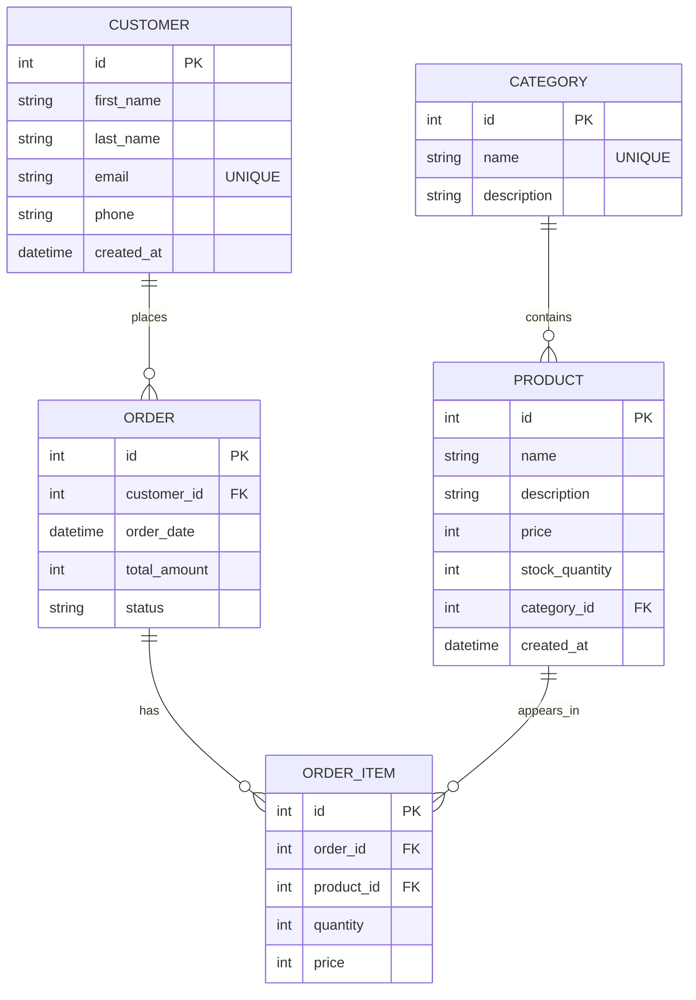

# E-COM CRUD API

A FastAPI + SQLModel ecommerce CRUD API with modular routes, Swagger docs, pagination, and business rules for stock and order totals.

## Navigation

- [Installation and Running Guide](#installation-and-running-guide)
- [Documentation URLs](#documentation-urls)
- [Technologies Used](#technologies-used)
- [Project File Organization](#project-file-organization)
- [Database UML Demo](#database-uml-demo)
- [Model Reference](#model-reference)
- [API Endpoint Reference](#api-endpoint-reference)
- [Business Rules Implemented](#business-rules-implemented)
- [Common Status Codes](#common-status-codes)

## Installation and Running Guide

### 1. Clone and open the project

```bash
git clone <your-repo-url>
cd E-COM-CRUD-API
```

### 2. Create and activate virtual environment

```bash
python3 -m venv .venv
source .venv/bin/activate
```

### 3. Install dependencies

```bash
pip install -r req.txt
```

### 4. Run the API

```bash
uvicorn main:app --reload
```

### 5. Open API docs

- Swagger UI: [http://127.0.0.1:8000/docs](http://127.0.0.1:8000/docs)
- ReDoc: [http://127.0.0.1:8000/redoc](http://127.0.0.1:8000/redoc)

## Documentation URLs

| Name | URL |
|---|---|
| Base API | [http://127.0.0.1:8000](http://127.0.0.1:8000) |
| Health Check | [http://127.0.0.1:8000/](http://127.0.0.1:8000/) |
| Swagger UI | [http://127.0.0.1:8000/docs](http://127.0.0.1:8000/docs) |
| ReDoc | [http://127.0.0.1:8000/redoc](http://127.0.0.1:8000/redoc) |

## Project File Organization

- [E-COM-CRUD-API](.)
  - [main.py](main.py)
  - [db.py](db.py)
  - [README.md](README.md)
  - [database.db](database.db)
  - [models](models)
    - [models/__init__.py](models/__init__.py)
    - [models/product.py](models/product.py)
    - [models/category.py](models/category.py)
    - [models/customer.py](models/customer.py)
    - [models/order.py](models/order.py)
    - [models/order_item.py](models/order_item.py)
  - [routes](routes)
    - [routes/__init__.py](routes/__init__.py)
    - [routes/products.py](routes/products.py)
    - [routes/categories.py](routes/categories.py)
    - [routes/customers.py](routes/customers.py)
    - [routes/orders.py](routes/orders.py)
    - [routes/order_items.py](routes/order_items.py)

## Database UML Demo

Graphical ER/UML demo (Mermaid):



## Model Reference

| Model | File | Kind | Main Fields | Relationships | Used By Endpoints |
|---|---|---|---|---|---|
| ProductCreate | [models/product.py](models/product.py) | Request schema | name, description, price, stock_quantity, category_id | category_id -> Category | POST/PUT products |
| Product | [models/product.py](models/product.py) | Response + table | id, created_at + ProductCreate fields | belongs to Category, has many OrderItem | All products endpoints |
| CategoryCreate | [models/category.py](models/category.py) | Request schema | name, description | None | POST/PUT categories |
| Category | [models/category.py](models/category.py) | Response + table | id + CategoryCreate fields | has many Product | All categories endpoints |
| CustomerCreate | [models/customer.py](models/customer.py) | Request schema | first_name, last_name, email, phone | None | POST/PUT customers |
| Customer | [models/customer.py](models/customer.py) | Response + table | id, created_at + CustomerCreate fields | has many Order | All customers endpoints |
| OrderCreate | [models/order.py](models/order.py) | Request schema | customer_id, order_date, total_amount, status | customer_id -> Customer | POST/PUT orders |
| Order | [models/order.py](models/order.py) | Response + table | id + OrderCreate fields | belongs to Customer, has many OrderItem | All orders endpoints |
| OrderItemCreate | [models/order_item.py](models/order_item.py) | Request schema | order_id, product_id, quantity, price | order_id -> Order, product_id -> Product | POST/PUT order-items |
| OrderItem | [models/order_item.py](models/order_item.py) | Response + table | id + OrderItemCreate fields | belongs to Order and Product | All order-items endpoints |
| OrderStatus | [models/order.py](models/order.py) | Enum | Pending, Completed, Cancelled | Used by Order.status | Orders endpoints |

## API Endpoint Reference

Base URL: [http://127.0.0.1:8000](http://127.0.0.1:8000)

### Products Endpoints

| Method | Endpoint URL | Request Model | Response Model | Notes |
|---|---|---|---|---|
| POST | [http://127.0.0.1:8000/products](http://127.0.0.1:8000/products) | ProductCreate | Product | Create product |
| GET | [http://127.0.0.1:8000/products](http://127.0.0.1:8000/products) | None | list of Product | Supports skip and limit |
| GET | [http://127.0.0.1:8000/products/{product_id}](http://127.0.0.1:8000/products/%7Bproduct_id%7D) | None | Product | Get one product |
| PUT | [http://127.0.0.1:8000/products/{product_id}](http://127.0.0.1:8000/products/%7Bproduct_id%7D) | ProductCreate | Product | Update product |
| DELETE | [http://127.0.0.1:8000/products/{product_id}](http://127.0.0.1:8000/products/%7Bproduct_id%7D) | None | 204 No Content | Delete product |

### Categories Endpoints

| Method | Endpoint URL | Request Model | Response Model | Notes |
|---|---|---|---|---|
| POST | [http://127.0.0.1:8000/categories](http://127.0.0.1:8000/categories) | CategoryCreate | Category | Create category |
| GET | [http://127.0.0.1:8000/categories](http://127.0.0.1:8000/categories) | None | list of Category | Supports skip and limit |
| GET | [http://127.0.0.1:8000/categories/{category_id}](http://127.0.0.1:8000/categories/%7Bcategory_id%7D) | None | Category | Get one category |
| PUT | [http://127.0.0.1:8000/categories/{category_id}](http://127.0.0.1:8000/categories/%7Bcategory_id%7D) | CategoryCreate | Category | Update category |
| DELETE | [http://127.0.0.1:8000/categories/{category_id}](http://127.0.0.1:8000/categories/%7Bcategory_id%7D) | None | 204 No Content | Delete category |

### Customers Endpoints

| Method | Endpoint URL | Request Model | Response Model | Notes |
|---|---|---|---|---|
| POST | [http://127.0.0.1:8000/customers](http://127.0.0.1:8000/customers) | CustomerCreate | Customer | Create customer |
| GET | [http://127.0.0.1:8000/customers](http://127.0.0.1:8000/customers) | None | list of Customer | Supports skip and limit |
| GET | [http://127.0.0.1:8000/customers/{customer_id}](http://127.0.0.1:8000/customers/%7Bcustomer_id%7D) | None | Customer | Get one customer |
| PUT | [http://127.0.0.1:8000/customers/{customer_id}](http://127.0.0.1:8000/customers/%7Bcustomer_id%7D) | CustomerCreate | Customer | Update customer |
| DELETE | [http://127.0.0.1:8000/customers/{customer_id}](http://127.0.0.1:8000/customers/%7Bcustomer_id%7D) | None | 204 No Content | Delete customer |

### Orders Endpoints

| Method | Endpoint URL | Request Model | Response Model | Notes |
|---|---|---|---|---|
| POST | [http://127.0.0.1:8000/orders](http://127.0.0.1:8000/orders) | OrderCreate | Order | Create order |
| GET | [http://127.0.0.1:8000/orders](http://127.0.0.1:8000/orders) | None | list of Order | Supports skip and limit |
| GET | [http://127.0.0.1:8000/orders/{order_id}](http://127.0.0.1:8000/orders/%7Border_id%7D) | None | Order | Get one order |
| PUT | [http://127.0.0.1:8000/orders/{order_id}](http://127.0.0.1:8000/orders/%7Border_id%7D) | OrderCreate | Order | Update order |
| DELETE | [http://127.0.0.1:8000/orders/{order_id}](http://127.0.0.1:8000/orders/%7Border_id%7D) | None | 204 No Content | Delete order |

### Order Items Endpoints

| Method | Endpoint URL | Request Model | Response Model | Notes |
|---|---|---|---|---|
| POST | [http://127.0.0.1:8000/order-items](http://127.0.0.1:8000/order-items) | OrderItemCreate | OrderItem | Creates item and decreases stock |
| GET | [http://127.0.0.1:8000/order-items](http://127.0.0.1:8000/order-items) | None | list of OrderItem | Supports skip and limit |
| GET | [http://127.0.0.1:8000/order-items/{order_item_id}](http://127.0.0.1:8000/order-items/%7Border_item_id%7D) | None | OrderItem | Get one order item |
| PUT | [http://127.0.0.1:8000/order-items/{order_item_id}](http://127.0.0.1:8000/order-items/%7Border_item_id%7D) | OrderItemCreate | OrderItem | Reconciles stock and totals |
| DELETE | [http://127.0.0.1:8000/order-items/{order_item_id}](http://127.0.0.1:8000/order-items/%7Border_item_id%7D) | None | 204 No Content | Restores stock and recalculates total |

## Technologies Used

| Technology | Icon | Version | Purpose |
|---|---|---|---|
| Python |  | 3.12.3 | Core programming language |
| FastAPI |  | 0.135.2 | Web framework and OpenAPI generation |
| SQLModel |  | 0.0.37 | ORM models and schema integration |
| SQLAlchemy |  | 2.0.48 | Database ORM engine |
| Pydantic |  | 2.12.5 | Data validation and serialization |
| Uvicorn |  | 0.42.0 | ASGI server for running the API |
| SQLite |  | File-based DB | Local development database |
